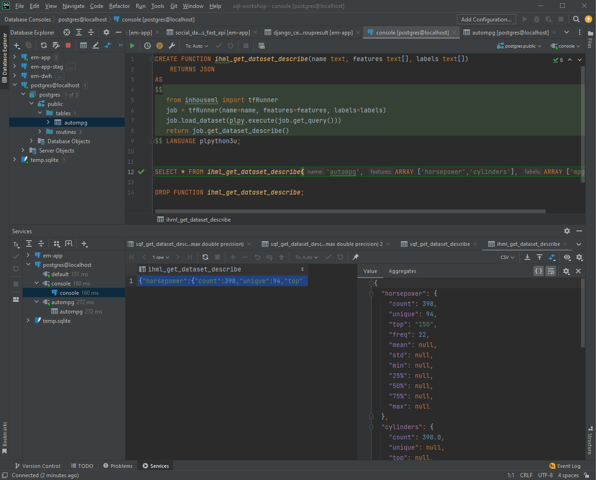

# Inhouse ML
A proof of concept to call Tensorflow APIs with SQL. In-db machine learning is widely used in the market. This project is a simplified way to share custom in-house ML implementation patterns without locking to a specific framework or library.


# Values
In scaling machine learning use cases, a data scientist can pair with multiple data analysts. This centralises the training data, engineered features, models, and forecasted data, making the mlops infrastructure more manageable. Inspired by BigQuery ML and AutoML from Google.

# Setup
```
docker-compose up --build
```

# Inhouse ML Patterns
```SQL
CREATE FUNCTION ihml_get_dataset_describe(name text, features text[], labels text[])
    RETURNS JSON
AS
$$
   from inhouseml import tfRunner
   job = tfRunner(name=name, features=features, labels=labels)
   job.load_dataset(plpy.execute(job.get_query()))
   return job.get_dataset_describe()
$$ LANGUAGE plpython3u;


SELECT * FROM ihml_get_dataset_describe('autompg', ARRAY ['horsepower','cylinders'], ARRAY ['mpg']);

DROP FUNCTION ihml_get_dataset_describe;

```

# Project Idea & Plan
1. Stored Procedures with PL/Python Functions 
https://www.postgresql.org/docs/current/plpython-funcs.html
2. use the stored python function via presto/trino 
https://trino.io/docs/current/sql/call.html
3. implement a python library, like a tensorflow wrapper, for interacting with the stored procedure.
4. in-db deep learning for profits


# Milestones
- [x] setup project
- [x] install python into the postgres image
- [x] execute simple python script with SQL
- [ ] create tensorflow functions for training & serving models
- [ ] create more complicated models
- [ ] introduce AutoML
- [ ] documentation, demo
